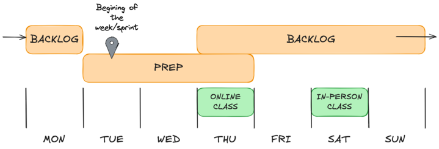

+++
title="Rhythm of the week"
emoji='🥁'
time=10
[objectives]
    1="Identify when we prep during a typical sprint week"
    2="Identify when we work on the backlog during a typical sprint week"
    3="Identify when the in-person session takes place on a typical sprint week"
[build]
  render = 'never'
  list = 'local'
  publishResources = false

+++

If we're expecting to get help with our problems in class, we need to have run into those problems before class.

Different people have different schedules - they may work different days or nights, or have other responsibilities.

To solve this problem, we use the **rhythm of the week**.

This rhythm supports MC students to plan their work during the week while still allowing flexibility in people’s different schedules. In a typical sprint week, Monday is the starting point with in-person sessions on Saturdays. We use Sundays and Mondays to reflect on our learning and finish off any backlog tasks.
