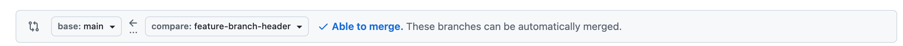

+++
title = "Pull Request Guidelines"
layout = "module"
menu = ["important information", "syllabus"]
description = "A practical guide for MigraCode students on how to use Pull Requests (PRs) as part of a real web development workflow"
weight = 4
emoji = "👩‍💻"
+++


# 👩‍💻 How to Do a Good Pull Request (PR)

At MigraCode, learning to use **Pull Requests (PRs)** is part of becoming a real-world web developer.  
PRs are not just about turning in work — they’re about **collaboration, feedback, and improvement**, exactly as in professional teams.

---

## 📌 Quick Links

- 🧾 [MigraCode PR Submission Form](https://docs.google.com/forms/d/e/1FAIpQLSesj1TzRyeaV5unZVI4Iqbgxf78qs3QVu0WSkxfr5W68HSlbg/viewform?usp=sharing&ouid=117762897010037598835)
- 📘 [GitHub Writing Guide](https://docs.github.com/en/get-started/writing-on-github)
- 🧭 [Git Branching Overview](https://docs.github.com/en/get-started/using-git/about-branches)


---

## 🧭 What Is a Pull Request?

A **Pull Request (PR)** is how you share your code before merging it into your main project branch.

In professional teams, PRs are used to:

- ✅ Share code changes  
- 💬 Ask for feedback  
- 🔄 Improve your work based on suggestions  
- 🚀 Merge confidently when everything is ready

At MigraCode, you’ll use PRs **within your own project repository** (personal or group), not in shared repos.  
This simulates a full, realistic development workflow:

1. Create a **feature branch**
2. Write and commit your code
3. Open a **PR against your own main branch**
4. Receive feedback from volunteers or instructors
5. Make improvements
6. ✅ Merge your branch

---

## 🌿 Preparing a Branch for a PR

### 1️⃣ Keep Your Branch Focused

A clean branch helps reviewers understand your work easily.

- Always **create a new branch** from `main` before coding  
- Don’t code directly on `main`  
- Focus on **one assignment or feature** per branch  

---

### 2️⃣ Write Clean, Understandable Code

Your reviewers should be able to follow your logic without guessing.

- Follow the **MigraCode Code Style Guide**  
- Use **clear, descriptive names** for variables and functions  
- Add **comments only when needed** for complex parts  
- Remove **console logs, unused imports, and dead code**  

---

## 🚀 Opening a Pull Request

When your branch is ready:

1. **Push** your branch to GitHub  
2. **Open a Pull Request** against your own `main` branch  
   > ⚠️ Do *not* open PRs to upstream repos like MigraCode Barcelona or CodeYourFuture  
3. Set:
   - **Target branch:** `main`  
   - **Source branch:** your feature branch  

**Example (correct setup):**



---

## 🧩 PR Title and Description

### 🏷️ Title Format

Use the following structure for your PR title:
Use the following structure for your PR title:

Name | Class | Module | Sprint | Assignment


**Example:**
Alice Doe | Oct2025-1 | OnBoarding | Sprint 2 | Weather App


### 📝 PR Description Template

A clear description helps reviewers give you meaningful feedback.  
Use this simple structure:

#### ✅ Self-Checklist

- [ ] I created this branch from `main`  
- [ ] I tested my code locally  
- [ ] I followed the code style guide  

#### 🔄 Changelist

Summarize what you did:

- Added weather API integration  
- Styled forecast component  
- Fixed city input bug  

#### ❓ Questions (Optional)

Ask for feedback or clarification if needed:

- Is my error handling clear enough?  
- Should I split this component further?  

---

## 💬 After Opening a PR

### 1️⃣ Request Review

Once your PR is open, submit it for review using this form:  
🧾 [MigraCode PR Submission Form](https://docs.google.com/forms/d/e/1FAIpQLSesj1TzRyeaV5unZVI4Iqbgxf78qs3QVu0WSkxfr5W68HSlbg/viewform?usp=sharing&ouid=117762897010037598835)


The form will automatically share your PR with your **CodeBuddy or another volunteer** for feedback.  
👉 Note: **Not all PRs are mandatory for volunteer review**, but submitting your PR is a great way to practice professional workflows.


### 2️⃣ Incorporate Feedback

When you receive a review, use it as a **learning opportunity**.  
Be open to constructive feedback — that’s how professionals grow.  

If something is unclear, reach out to your reviewer on Slack.  
Volunteers are here to help you learn 💪


### 3️⃣ Merge Your PR

✅ When your work is approved or ready, **merge into `main`**.

Merging is important because it:

- Shows you take ownership of your work  
- Keeps your main branch up to date  
- Completes the development cycle used in real teams
- Ensures your changes are incorporated before you start making more edits  

---

## 🌱 Final Notes

Pull Requests are not only for submitting assignments — they’re a tool for **collaboration, feedback, and growth**.  

Each PR helps you:

- Practice **professional workflows**
- Get **constructive feedback**
- Build **confidence** as a developer
- Learn to **work like real software teams**

Use PRs consistently — it’s one of the best ways to level up your skills. 💪



GitHub supports **Markdown** formatting in PRs, comments, and READMEs.  
You can:

- Create checklists with `[x]`  
- Use **bold** and *italics*  
- Add code with triple backticks ```  
- Mention users with `@username`  

Learn more here:  
👉 [GitHub Writing Guide](https://docs.github.com/en/get-started/writing-on-github)



